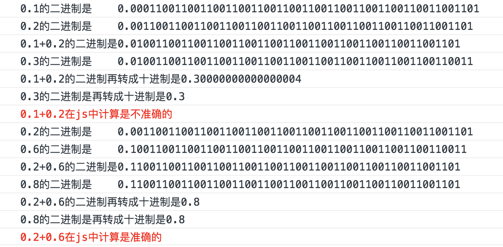
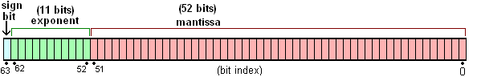
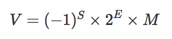

## 一、JavaScript数据类型
ECMAScript规定了7种数据类型，这7种类型又分为两种：原始类型和对象类型.
### 原始类型
- Null
- Undedfined
- Boolean
- Number: 包括(-Infinity、+Infinity、NaN)
- String
- Symbol: 一种实例是唯一且不可改变的数据类型
- BigInt: 2^53 - 1 的整数
### 对象类型
- Object: Object、Array、Function
## 二、为什么区分原始类型和对象类型
### 2.1 不可变性
上面提到的原始类型，在ECMAScript标准中被定义为`primitive values`, 原始值, 代表本身是不可改变的。  
变量在内存中需要一个空间来存储。内存空间有两种：栈内存和堆内存。
栈内存：
- 存储的值大小固定
- 空间较小
- 可以直接操作其保存的变量，运行效率高
- 由系统自动分配存储空间
原始值类型的值被直接存储在栈中，在变量定义时，栈就为其分配好了内存空间.
由于栈中的内存空间的大小是固定的，那么注定了存储在栈中的变量就是不可变的。
### 2.2 引用类型
堆内存：
- 存储的值大小不定，可动态调整
- 空间较大，运行效率低
- 无法直接操作其内部存储，使用引用地址读取
- 通过代码进行分配空间
### 复制
复制引用类型的变量时，实际上复制的占中存储的地址。
### 值传递和引用传递
ECMA中所有的函数的参数都是按值传递的。
当函数参数是引用类型时, 我们同样将参数复制了一个副本到局部变量，只不过复制的这个副本是指向堆内存的地址而已。
```javascript
let obj = {};
function changeValue(obj){
  obj.name = 'ConardLi';
  obj = {name:'code秘密花园'};
}
changeValue(obj);
console.log(obj.name); // ConardLi
```
### 三、Symbol类型
Symbol类型是Es6中新加入的一种原始类型
> 每个从Symbol()返回的symbol值都是唯一的。一个symbol值能作为对象属性的标识符；这是该数据类型仅有的目的。
### 3.1 Symbol的特性
直接使用Symbol()创建新的symbol变量，可选用一个字符串用于描述。当参数为对象时，将调用对象的toString()方法。
1. 独一无二
直接使用Symbol()创建新的symbol变量，可选用一个字符串用于描述。当参数为对象时，将调用对象的toString()方法。
```javascript
var sym1 = Symbol()
var sym2 = Symbol('aaalll')
var sym3 = Symbol('aaalll')
var sym4 = Symbol({name: 'aaalll'})
console.log(sym2 === sym3) // false
```
2. 不可枚举
当使用Symbol作为对象属性时，可以保证对象不会出现重名属性，调用for...in 不能将其枚举出来，另外调用Object.getOwnPropertyNames、Object.keys()也不能获取Symbol属性。
>可以调用Object.getOwnPropertySymbols()用于专门获取Symbol属性
### 3.2 Symbol应用场景
- 防止XSS
- 私有属性
- 防止属性污染
## 四、Number
### 精度问题
0.1 + 0.2 !== 0.3 ???  
首先我们要了解进制转换：
- 二进制 => 十进制 每一位乘以10^{n-1} 
- 十进制 => 二进制 除以10取余 从后往前将余数连起来就是
- 十进制小数 => 二进制 每次将小数部分乘以2 取整数部分 从头到尾连接起来就可
然后我们依据进制转换的规则来将等号左右的三个值的二进制计算出来:  

造成这种现象的原因是什么呢？  
原来计算机中所有的数据都是以二进制存储的，所一计算机在计算时要把数据转成二进制进行计算，然后再把计算结果转换成十进制。
### js对二进制小数的存储方式
小数的二进制多是无限循环的, js怎么来存储他们的呢？
ECMAScript中的Number类型遵循IEEE754标准。使用64位固定长度来表示。  
下面我们来说下IEEE754
IEEE754标准包含一组实数的二进制表示法。它由三部分组成：
- 符号位
- 指数位
- 尾数位    

|  精度  | 符号 | 阶/指数 | 尾数 | 总位数 |
| ------ | --- | ----   | --- | ---- |
| 单精度  |  1  |   8    |  23  |  32  |
| 双精度  |  1  |   11   |  52  |  64  |
| 长双精度 |  1  |  15   |  64  |  80 |
js使用的是64位双精度浮点编码, 所以符号位1位，指数位11位，尾数位52位   
我们来以0.1为例：  
它的二进制为：0.0001100110011001100...  
为节省空间，在计算机中它是以科学计数法表示的，也就是
1.100110011001100... X 2^-4

- 符号位S 1为正 0 为负 
- 指数位E 存储科学计数法的指数
- 尾数位M 来存储科学计数法的有效数字  

所以我们通常看到的二进制，其实计算机实际存储的尾数位
由于尾数位只能存储52个数字，这就能解释toString(2)的执行结果  
如果计算机没有存储空间的限制，那么0.1的二进制应该是:
0.00011001100110011001100110011001100110011001100110011001...  
科学计数法尾数位：
1.1001100110011001100110011001100110011001100110011001...
但是由于限制，有效数字第53位及以后的数字是不能存储的，它遵循，如果是1就向前一位进1，如果是0就舍弃的原则。  
0.1的二进制科学计数法第53位是1，所以
0.0001100110011001100110011001100110011001100110011001101
0.2有着同样的问题，正是由于这样的存储，有了精度丢失，导致0.1+0.2!= 0.3
### js能表示最大的数字
由于IEEE754的限制:
- 指数位能表示最大的数字： 1023(十进制)
- 尾数位能表达的最大数字即尾数位都是1的情况 2^53 -1 为9007199254740991
因此，js中能表达的最大的数字是1.1111..X2^1023这个结果转换成十进制是1.7976931348623157e+308(1.1111111111是二进制的值，转十进制是1.999....98),这个结果即为Number.MAX_VALUE
### 最大安全数字
js中Number.MAX_SAFE_INTEGER表示最大安全数字，计算结果是9007199254740991，即在这个数范围内不会出现精度丢失(小数除外), 这个数1.111...X2^52
注：我们可以使用开源库来处理大数,node-bignum,node-bigint，也可以使用bigInt类型。
## 其他的引用类型
我们通常说的对象，就是某个特定引用类型的实例.
- Array
- Date
- RegExp 正则
- Function
### 包装类型
- Boolean
- Number
- String  
```javascript
true === new Boolean(true) // false
1234 === new Number(1234) // false
console.log(typeof new Boolean(true)) // object
```
包装类型和原始类型的区别:  
>在于对象的生命周期,使用new操作符创建的引用类型的实例，在执行流离开当前作用域之前都一直保存在内存中，而自基本类型则只存在于一行代码的执行瞬间，然后立即被销毁，这意味着我们不能在运行时为基本类型添加属性和方法。
## 五、类型转换
我们在对各种非Number类型运用数字运算符(`- * /`)时，会将非Number类型转换为Number类型;  
```js
1 - true // 0
1 - null // 1
1 * undefined // NaN
2 * ['5'] // 10
```
但是`+`是个例外:
- 当一侧为String类型，被识别为字符串拼接，并优先将另一侧转换为字符串类型
- 当一侧为Number类型，另一侧为原始类型，则将原始类型转换为Number类型
- 当一侧为Number类型 另一侧为引用类型，将引用类型和Number类型转为字符串再拼接
```js
123 + {} // 123[object Object]
{} + 123 // 123 ???
```
### ==
1. NaN和其他类型比较永远返回false  
2. Boolean和其他任何类型比较，Boolean首先被转换为Number类型
undefined,null和Boolean比较，虽然undefined,null和false都很容易被想象成假值，但是他们比较结果是false，原因是false首先被转成0
```js
undefined == false
null == false
```
3. string和number
String和Number比较,先将string转换为Number类型
4. null和undefined
null和undefined比较结果是true，除此之外，null, undefined和其他任何结果的比较值都为false
```js
null == undefined // true
null == '' // false
null == 0 // false
undefined == 0 // false
undefined == false // false
```
5. 原始类型和引用类型
当原始类型和引用类型作比较时，对象类型会依照ToPrimitive规则转化为原始类型：
```js
'[object Object]' == {} // true
'1,2,3' == [1, 2, 3] // true
[] == ![] // true
```
!的优先级高于== ,![]首先被转换为false, false转换成Number类型0，左侧[]转换为0，两侧比较相等
面试题：如何让a == 1 && a == 2 && a == 3 
```js 
const a = {
  value: [1, 2, 3],
  valueOf: function () {
    return this.value.shift()
  }
}
```
## 判断数据类型
- typeof 判断原始类型: string, number, boolean, undefined, symbol, bigint。也可以判断function  
当typeof 判断非function的引用类型就不行了。
- instanceof 可以判断引用类型具体是什么类型的对象：
```js
[] instanceof Array // true
new Date() instanceof Date // true
new RegExp() instanceof RegExp // true
```
但是它并不准确
```js
[] instanceof Object // true
function () {} instanceof Object // true
```
- toString
>每一个引用类型都有toString方法，默认情况下，toString()方法被每个Object对象继承。如果此方法在自定义对象中未被覆盖，toString() 返回 "[object type]"，其中type是对象的类型。

参考：
[【JS 进阶】你真的掌握变量和类型了吗](https://juejin.im/post/5cec1bcff265da1b8f1aa08f)