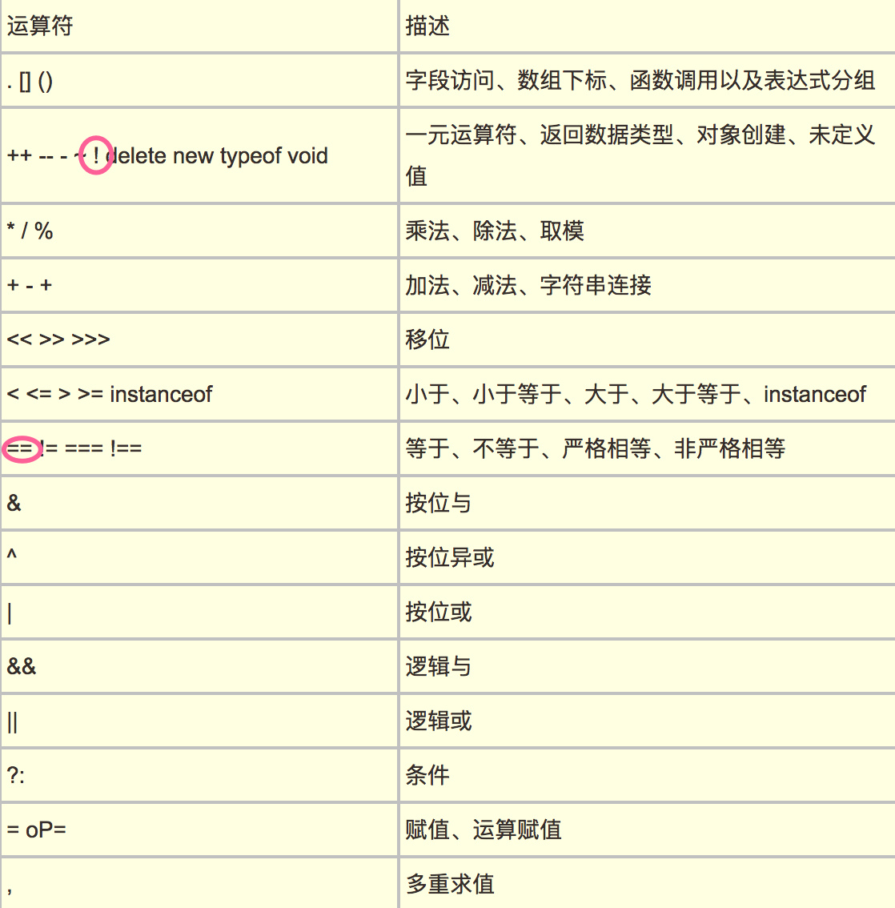
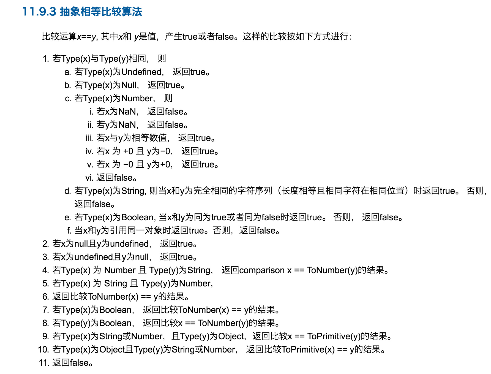
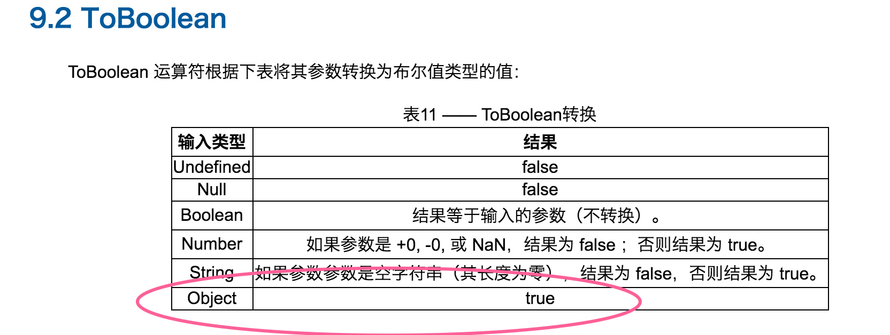
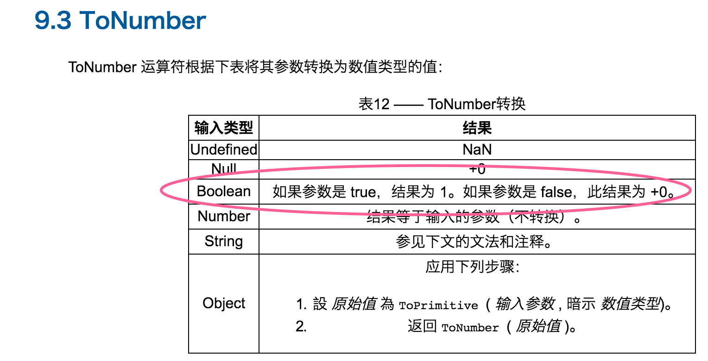
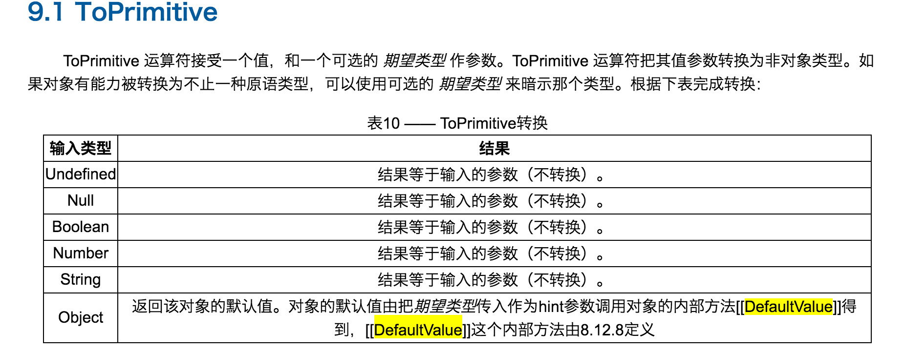
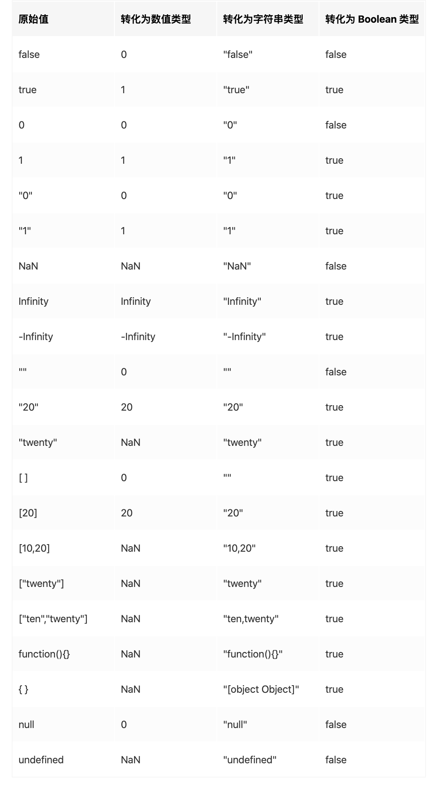

# 类型转换
## [] == ![] 为true ?
优先级

如何判断 ==  

![]的优先级高 toBoolean([])为true， 等号右边![] 为false
此时为 [] == false  
再将 等号左右两侧TO=toNumber [] => string = '' => number = 0  
false => number = 0, 0 == 0 // true
规则总结：
1. undefined == null，结果是true。且它俩与所有其他值比较的结果都是false。

2. String == Boolean，需要两个操作数同时转为Number。

3. String/Boolean == Number，需要String/Boolean转为Number。

4. Object == Primitive，需要Object转为Primitive(具体通过valueOf和toString方法)。

下图是常见类型转换表：

内容摘自：
- [从 []==![] 为 true 来剖析 JavaScript 各种蛋疼的类型转换](https://github.com/jawil/blog/issues/1#)
- [JavaScript 运算符规则与隐式类型转换详解](https://juejin.im/post/59ad2585f265da246a20e026)